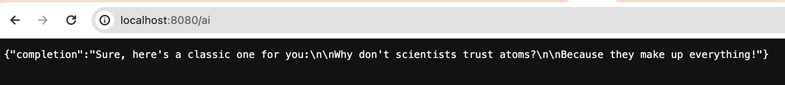

## OPEN AI based Interactive Chat Application using Spring Boot

### Generate API Token from Open AI
* Create an account at OpenAI Signup and generate the token at API Keys.
* [OpenAI Signup](https://auth0.openai.com/u/signup/identifier?state=hKFo2SBHQmI3SFRBOENpY3FpNW54TWppWF9fY3RwbFJtUlZiNKFur3VuaXZlcnNhbC1sb2dpbqN0aWTZIHAwdTdPak1FdlBVZUtXT1d0d0JhMi0yYXlkbVhhUkl0o2NpZNkgRFJpdnNubTJNdTQyVDNLT3BxZHR3QjNOWXZpSFl6d0Q)
* [Generate API Token](https://platform.openai.com/account/api-keys)

Sample Output, since the default prompt is : "Tell me a joke! "

Giving a custom prompt: 
